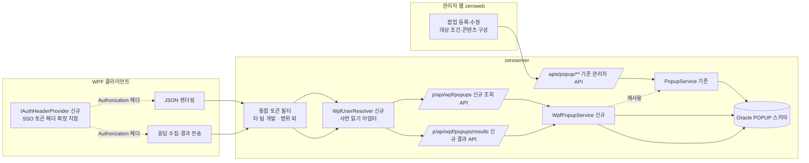

# 02. 목표 아키텍처 및 통신 정책

기준 항목 2, 4, 7을 다룬다.

## 0. 변경 원칙 — 기존 구조 변경 최소화, 기능 추가 방식

`zero-rule-server-main`(이하 zeroserver)과 `zero-rule-web`(이하 zeroweb)은 다른 업무가 함께 사용하는 공통 프레임워크다. 이번 개선은 아래 원칙을 따른다.

| 원칙 | 적용 방법 |
|---|---|
| 기존 클래스·필터·매퍼·화면을 **재구성하지 않는다** | 새 컨트롤러, 새 필터, 새 매퍼 XML, 새 서비스 클래스를 **추가**한다. 기존 `PopupController`, `PopupService`, `PopupMapper.xml`, `CustomAuthenticationFilter`, `SecurityConfig`의 시그니처와 동작은 유지한다 |
| 기존 코드 수정은 **불가피한 최소 범위**로 한정한다 | 수정이 필요한 곳은 아래 §5 표에 "수정"으로 명시하고 이유를 적는다. 표에 없는 기존 파일은 건드리지 않는다 |
| 기존 WPF API(`/p/api/popups/**` 6개)는 **삭제하지 않고 유지**한다 | 새 WPF는 `/p/api/wpf/**`를 사용한다. 기존 경로는 전환 완료 후 별도 결정으로 제거한다 (09 문서) |
| DB는 **테이블 구조를 유지**하고 Oracle 문법으로만 변환한다 | 기존 16개 테이블의 컬럼 구성은 바꾸지 않는다. 신설은 결과 멱등 키 테이블 1개로 한정하고, 인증 관련 테이블·컬럼은 만들지 않는다 (05 문서) |
| 추가·수정한 **모든 소스에 기능과 추가 이유를 상세 주석**으로 남긴다 | 파일 헤더에 "역할 / 추가 이유(기준 항목 번호) / 기존 구조와의 관계", 주요 메서드에 동작·예외·주의사항을 적는다. 설계 문서의 스켈레톤도 동일하게 작성한다 |

각 설계 문서 끝에는 이 원칙을 지켰는지 **자체 점검표**(추가/수정/삭제 분류)를 둔다.

## 1. 전체 구성

## 2. 역할 분담 (기준 7)

| 구성 요소 | 담당 | 담당하지 않음 |
|---|---|---|
| 관리자 웹 (zeroweb) | 팝업 등록·수정, 활성/비활성, 대상 조건 그룹 설정, 유형별 콘텐츠·문항 구성, 미리보기 | 노출 대상 계산, 사용자 상태 관리 |
| 서버 (zeroserver) | 팝업 데이터 저장, **노출 대상 최종 계산**(사용자·대상 조건·기간·활성·숨김·완료), 최종 팝업 JSON 조립, 채점·완료 판정, 결과 저장, WPF 토큰 발급·검증 | 화면 표시 로직 |
| WPF | SSO → WPF 토큰 획득, 팝업 JSON 수신, **렌더링**, 사용자 응답·시청 정보 수집, 종료 시점에 **결과 1회 전송** | 노출 여부 판단(기간·숨김·완료 로컬 판단 제거), 채점, 진행률 실시간 전송 |

## 3. 통신 시점 정책 (기준 4)

| 시점 | 호출 | 횟수 | 비고 |
|---|---|---|---|
| WPF 시작 | (인증 토큰 획득 — 타 팀 통합 토큰 방식에 따름, 우리 범위 외) | – | WPF는 `IAuthHeaderProvider`가 준 값을 헤더에 붙이기만 함 |
| WPF 시작 직후 / 수동 새로고침 / 주기 조회 | `GET /p/api/wpf/popups` | 1회/시점 | 표시할 최종 팝업 목록 + 공통 옵션 + content + 문항·선택지 모두 포함 |
| 팝업 종료·완료·제출 | `POST /p/api/wpf/popups/results` | 팝업 1개당 1회 (또는 종료 시 일괄) | 닫기/숨김/제출/영상 시청 결과를 하나의 결과 항목으로 전송 |

**제거하는 호출**

| 현행 | 대체 |
|---|---|
| `POST /{id}/events` DISPLAYED / CLOSED (팝업당 2회) | 결과 항목의 `displayedAt`, `closedAt`, `displayCount`로 종료 시 함께 전송 |
| `POST /{id}/video-progress` (주기 타이머) | 결과 항목의 `video` 블록(누적 시청·최대 도달 위치)으로 종료 시 1회 전송. 완료 판정은 서버 |
| `GET /statuses` (조회마다) | 서버 조회 SQL이 완료 팝업을 제외하므로 불필요 |
| `POST /{id}/hide`, `POST /{id}/responses` | 결과 API의 `resultType = HIDDEN / SUBMITTED` |

주기 조회(`PollingIntervalSeconds`)는 유지하되 기본값을 300초 → **1800초**로 늘리고, 팝업이 열려 있는 동안은 조회를 건너뛴다 (07 문서).

**전송 실패 처리**: 결과 전송 실패 시 WPF는 로컬 큐(`%LOCALAPPDATA%\Popup\pending-results.json`)에 보관하고 다음 시작·조회 시점에 재전송한다. 서버는 `clientRequestId`로 중복을 무시한다 (03 문서 §4).

## 4. 노출 대상 판단 — 서버 단일화 (기준 2)

서버 조회 SQL(`selectWpfAvailablePopups`, 06 문서)이 다음을 모두 판단한다. WPF는 결과를 그대로 렌더링한다.

| 판단 | 규칙 |
|---|---|
| 사용자 | 토큰의 `employeeNo`가 `APP_USER.ACTIVE_YN='Y'` |
| 활성 | `POPUP_NOTICE.ACTIVE_YN='Y'` |
| 기간 | `DISPLAY_START_AT <= SYSTIMESTAMP <= DISPLAY_END_AT` |
| 대상 조건 | 그룹 내 AND, 그룹 간 OR. 부서 하위 포함은 재귀 조회 |
| 숨김 | `USER_POPUP_STATUS.HIDDEN_UNTIL_AT > SYSTIMESTAMP`이면 제외 |
| 완료 | `USER_POPUP_STATUS.COMPLETED_YN='Y'`이면 제외 (SURVEY/QUIZ/VIDEO). TEXT/IMAGE는 완료 개념이 없어 숨김·기간으로만 제어 |
| 문항 템플릿 | SURVEY/QUIZ는 `QUESTION_TEMPLATE.ACTIVE_YN='Y'`일 때만 |
| 정렬 | `DISPLAY_ORDER`, `CREATED_AT`, `POPUP_ID` |

응답에는 서버 시각 `serverTime`을 함께 내려 WPF가 시각 판단을 하지 않도록 한다.

## 5. 구성 요소별 변경 분류 (자체 점검)

| 구성 요소 | 추가 | 수정 (최소) | 삭제 |
|---|---|---|---|
| zeroserver | `WpfPopupController`, `WpfPopupService`, `WpfResultProcessor`, `PopupContentAssembler`, `WpfUserResolver`(+ 구현 2), `WpfApiExceptionHandler`, `WpfPopupMapper` + XML, WPF DTO 패키지 | `PopupService`: public 위임 메서드 2개·분기 1개 · `PopupMapper.xml`: Oracle 문법 변환(구조 동일) · `application-*.yml`: 데이터소스·WPF 속성 추가 · `build.gradle.kts`: 드라이버 토글 | 없음 (기존 6개 WPF API 유지). **인증 필터·토큰 API는 타 팀 범위** |
| zeroweb | 없음 (필요 시 SURVEY 채점 입력 숨김 토글 1건) | `PopupEditorDialog.tsx`: SURVEY일 때 채점·통과점수 입력 비표시 (조건부 렌더링 추가) | 없음 |
| WPF | `IAuthHeaderProvider`(+ None/Static 구현), `PopupResultQueue`, `PopupResultBuilder`, 결과 DTO | `PopupApiService`: 새 엔드포인트 메서드 추가·Authorization 헤더 부착 · `MainWindow`: statuses 호출·로컬 정책 제거 · `PopupManager`: 이벤트 콜백을 결과 수집으로 교체 | `PopupPolicyService`, `PopupStorageService`(숨김 로컬 저장), `VideoPopupView`의 `_progressSaveTimer` |
| DB | 테이블 1개 신설 (`WPF_RESULT_RECEIPT` 결과 멱등 키), 시퀀스 12개 | 전 테이블 Oracle 문법 변환 (컬럼 구성 동일) | 없음. **인증 테이블·컬럼 없음** |

WPF는 공통 프레임워크가 아니라 이번 과제의 전용 클라이언트이므로 삭제·교체를 허용한다.
