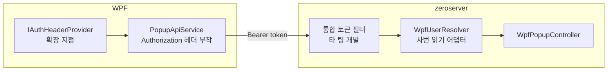

# 04. 인증 연동 설계 — WPF 헤더 전송 형태만 준비

기준 항목 6. **2026-09-19 범위 확정**: zeroserver의 토큰 인증은 관리자 웹과 WPF가 공유하는 **하나의 통합 토큰**으로 **다른 팀이 추가 개발**한다. 우리 범위는 다음으로 한정한다.

| 우리 팀 범위 (이번 설계) | 범위 외 (타 팀) |
|---|---|
| WPF가 사내 SSO 토큰을 받아 `Authorization: Bearer {token}` 헤더로 보낼 수 있는 **확장 지점** | SSO 연동, 토큰 발급 API, 토큰 검증 필터, 토큰 저장 테이블·컬럼 |
| 서버 WPF API가 "인증된 사용자 사번"을 읽는 **얇은 어댑터 인터페이스** | 그 어댑터에 값을 채우는 실제 인증 처리 |
| 개발·테스트용 임시 사용자 지정 방법 (개발 프로파일 한정) | — |

지금 시점에 인증이 실제로 동작할 필요는 없고, 인증용 DB 컬럼·테이블은 만들지 않는다. 이전 초안의 `WPF_AUTH_TOKEN` 테이블, `WpfTokenService`, `WpfTokenAuthenticationFilter`, `WpfAuthController`는 **설계에서 제외**했다.

## 1. 구성



## 2. WPF — `IAuthHeaderProvider` 확장 지점

```csharp
/*
 * [역할] 서버 요청에 붙일 Authorization 헤더 값을 제공한다.
 * [추가 이유 — 기준 6] 서버 통합 토큰은 타 팀이 개발 중이며 SSO 규격도 미확정이다.
 *   PopupApiService가 인증 방식을 몰라도 되도록 헤더 값 공급만 인터페이스로 분리해 둔다.
 *   나중에 사내 SSO 클라이언트를 붙일 때 이 인터페이스 구현체 하나만 추가하면 된다.
 * [현재 구현체]
 *   - NoAuthHeaderProvider   : 헤더를 붙이지 않음 (서버 필터 적용 전 기본값)
 *   - StaticAuthHeaderProvider: appsettings의 고정 문자열을 그대로 전달 (개발·연동 테스트용)
 * [향후 구현체] SsoAuthHeaderProvider: 사내 SSO에서 토큰을 받아 캐시하고 만료 시 재발급
 */
public interface IAuthHeaderProvider
{
    /// <summary>헤더 값(예: "Bearer eyJ...")을 반환한다. null이면 헤더를 붙이지 않는다.</summary>
    Task<string?> GetAuthorizationHeaderAsync(CancellationToken ct = default);

    /// <summary>서버가 401을 돌려줬을 때 호출된다. 토큰 재발급이 가능한 구현체는 여기서 갱신한다. 기본은 아무 것도 하지 않는다.</summary>
    Task OnUnauthorizedAsync(CancellationToken ct = default) => Task.CompletedTask;
}
```

`PopupApiService`는 모든 요청 전에 `GetAuthorizationHeaderAsync()`를 호출해 값이 있으면 `Authorization` 헤더를 붙이고, 401 응답 시 `OnUnauthorizedAsync()` 후 **1회 재시도**한다. 구현체 선택은 `appsettings.json`으로 한다:

```json
"PopupApi": {
  "Auth": {
    "Mode": "None",            // None | Static | Sso(향후)
    "StaticHeader": ""         // Mode=Static일 때 "Bearer ..." 문자열. 운영 배포 시 비움
  }
}
```

토큰은 파일에 저장하지 않고 메모리에만 둔다. 요청 본문·쿼리에는 `userId`를 넣지 않는다 (기준 6 "요청의 userId가 아닌 토큰 기준").

## 3. 서버 — `WpfUserResolver` 어댑터

타 팀 필터가 `SecurityContextHolder`에 어떤 형태의 `Authentication`을 넣을지 아직 모르므로, WPF API는 사번을 직접 꺼내지 않고 인터페이스를 통해 읽는다.

```java
/**
 * [역할] 현재 요청의 인증된 사용자 사번(APP_USER.EMPLOYEE_NO)을 반환한다.
 * [추가 이유 — 기준 6] 통합 토큰 인증은 타 팀이 개발한다. WPF API(WpfPopupController)가
 *   그 구현 세부(Authentication 타입, principal 필드명)에 의존하지 않도록 사번 읽기만 인터페이스로 분리한다.
 *   타 팀 필터가 완성되면 구현체 1개(SecurityContextWpfUserResolver)의 매핑만 맞추면 된다.
 * [구현체]
 *   - SecurityContextWpfUserResolver : SecurityContextHolder의 Authentication에서 사번 추출 (기본). 매핑 규칙은 타 팀과 합의 후 확정
 *   - DevHeaderWpfUserResolver       : 개발 프로파일 한정. 요청 헤더 X-Dev-User-Id 값을 사번으로 사용. 운영 프로파일에서는 빈 등록 금지
 * [실패] 사번을 얻을 수 없으면 WpfUnauthorizedException → 401 WPF_UNAUTHORIZED
 */
public interface WpfUserResolver {
    String resolveEmployeeNo(HttpServletRequest request);
}
```

```java
/** 개발용. custom.wpf-popup.dev-user-header=true 일 때만 빈 등록. */
@Component @ConditionalOnProperty(name = "custom.wpf-popup.dev-user-header", havingValue = "true")
public class DevHeaderWpfUserResolver implements WpfUserResolver {
    public String resolveEmployeeNo(HttpServletRequest req) {
        String v = req.getHeader("X-Dev-User-Id");
        if (v == null || v.isBlank()) throw new WpfUnauthorizedException();
        return v.trim();
    }
}
```

`WpfPopupController`는 `wpfUserResolver.resolveEmployeeNo(request)`로 사번을 얻어 서비스에 넘긴다. 사번이 `APP_USER`에 없거나 `ACTIVE_YN='N'`이면 403 `WPF_USER_INACTIVE` (기존 `countActiveUserAndPopup`류 조회 재사용).

## 4. 타 팀과 합의할 항목

| 항목 | 우리 요구 |
|---|---|
| 필터 적용 경로 | `/p/api/wpf/**`에 통합 토큰 검증 적용. 현재 `/p/**`는 `DefaultPublicUrls`로 공개이므로 타 팀 필터가 이 경로를 어떻게 다룰지 확인 |
| 사번 전달 방식 | `Authentication`의 어느 필드에 사번(`EMPLOYEE_NO`)이 들어오는지 → `SecurityContextWpfUserResolver` 매핑 |
| 401 응답 형식 | WPF가 만료를 인식할 수 있는 상태 코드(401) 보장. 본문 형식은 무관 |
| 토큰 획득 방식 | WPF가 SSO 토큰을 어디서 어떻게 받아 어떤 문자열을 헤더에 넣는지 → `SsoAuthHeaderProvider` 구현 시 필요 |

## 5. 자체 점검 — 기존 구조 변경 여부

| 구분 | 항목 |
|---|---|
| 추가 (서버) | `WpfUserResolver`, `SecurityContextWpfUserResolver`(매핑 TBD), `DevHeaderWpfUserResolver`, `WpfUnauthorizedException` |
| 추가 (WPF) | `IAuthHeaderProvider`, `NoAuthHeaderProvider`, `StaticAuthHeaderProvider` |
| 수정 | 없음 (`SecurityConfig`, `CustomAuthenticationFilter`, `DefaultPublicUrls`, 로그인 컨트롤러 미수정) |
| 삭제 | 없음 |
| DB | 인증 관련 테이블·컬럼 없음 |

## 6. SSO·토큰 프로토타입 (2026-09-21 추가 — 설계 10)

§0의 범위(운영 토큰은 타 팀)는 그대로이며, **통신 형태와 `401 → 재로그인 → 원 요청 재전송` 동작만 검증하는 프로토타입**을
[10_WPF_SSO_토큰_프로토타입_계획.md](10_WPF_SSO_토큰_프로토타입_계획.md)에 따라 구현했다. 운영 인증이 아니므로 서버 기본값은 꺼져 있다.

| 구분 | 항목 |
|---|---|
| 추가 (서버, popup 영역) | `WpfAuthPrototypeProps`(`custom.wpf-auth-prototype.enabled/token-ttl-minutes`), `WpfAuthController`(`POST /p/api/wpf/auth/login`), `WpfPrototypeTokenStore`(JVM 메모리, TTL 10분), `PrototypeTokenWpfUserResolver`(`WpfUserResolver` 구현, `@Primary`, Bearer 토큰 검사 → 401), `WpfLoginRequest`/`WpfLoginResponse` |
| 수정 (popup 영역) | `WpfApiExceptionHandler` — `assignableTypes`에 `WpfAuthController` 추가. `application-local.yml` — `enabled: true`(로컬 전용), `application-common.yml` — 주석만 |
| 추가 (WPF) | `SsoClient`(Windows 통합 인증 GET → XML `MAIN_USER_ID`·`MAIN_USER_CLASSI_CODE`), `WpfLoginClient`, `SsoAuthHeaderProvider`(`IAuthHeaderProvider` 구현, 메모리 토큰, `SemaphoreSlim` 재로그인 1회, 1시간 `PeriodicTimer`) |
| 수정 (WPF) | `IAuthHeaderProvider.OnUnauthorizedAsync(failedAuthorizationHeader)` — 401을 받은 요청의 헤더를 넘겨 동시 401에서 재로그인을 1회로 제한. `PopupApiService`는 그 값을 넘기는 한 줄만 변경. `MainWindow`에 `Auth.Mode=SsoPrototype` 분기, `PopupClientSettings`에 `SsoUrl/LoginPath/PeriodicLoginMinutes` |
| 공통 프레임워크 | 변경 없음 (`/p/**` 공개 경로라 `SecurityConfig`·`DefaultPublicUrls` 미수정) |
| DB | 없음 (토큰은 서버 메모리, 인증 이력 미저장) |

운영 전환 시 `WpfAuthController`·`WpfPrototypeTokenStore`·`PrototypeTokenWpfUserResolver`는 제거하거나 `enabled=false`로 두고, WPF는 `IAuthHeaderProvider` 구현체만 교체한다.
