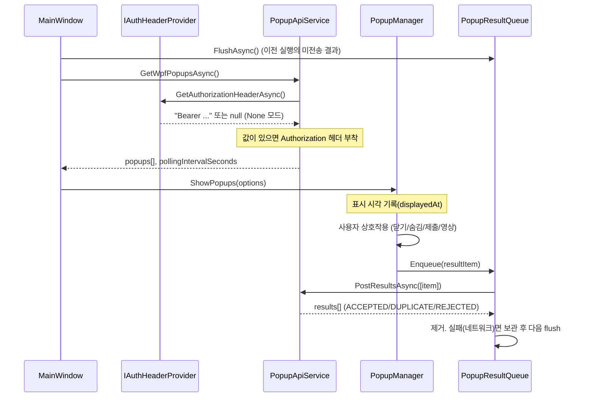

# 07. WPF 클라이언트 변경 설계 — 구현 반영 (2026-09-19, 단계 6 완료)

> **구현 결과 요약** — 아래 설계대로 구현했고 `dotnet build`(net10.0-windows, Debug) 경고 0·오류 0. 설계와 다른 점:
> - `WpfAuthService`(SSO 토큰 획득) 대신 `Service/Auth/IAuthHeaderProvider` + `NoAuthHeaderProvider`/`StaticAuthHeaderProvider` (04 문서, 인증은 타 팀 통합 토큰).
> - `appsettings.json`: `UserId` 제거, `Auth.Mode/StaticHeader`, `DevUserId`(개발 헤더 `X-Dev-User-Id`) 추가. `launchSettings.json`은 `POPUP_DEV_USER_ID`.
> - `SurveyPopupView`의 로컬 퀴즈 채점(`CalculateScore`·`_passingScore`) 제거 — 서버가 정답을 내려주지 않으므로 채점 불가. 통과/미통과 안내는 결과 API 응답으로 `PopupManager`가 표시.
> - `PopupWindow`의 "완료 전 닫기 금지" 판단은 실시간 서버 판정 대신 `VideoPopupView.HasReachedCompletion(ratio)` 로컬 추정 사용(최종 판정은 서버).
> - `PopupWindow.OnClosing`에서 "다시 보지 않기" 체크를 `PopupOptions.DoNotShowAgainChecked`에 기록(ESC/Alt+F4 경로 포함).
> - `PopupOptions`에 `PopupType`, `HideDays` 추가(결과 항목 조립·제출 안내 분기용).
> - 미검증: 실제 서버 연동(Oracle·통합 토큰 없음). 데모 모드는 `ReportResult*` 훅이 null이라 전송 없이 동작.


기준 항목 2·3·4·6·7의 WPF 측 구현. 대상: `popup-frameWork/Popup/`. WPF는 이번 과제 전용 클라이언트이므로 삭제·교체를 허용하되, 렌더링 계층(`Views/**`, `PopupFactory`, `PopupWindow`)은 **현행 구조를 유지**하고 서비스·매니저 계층만 바꾼다.

## 1. 변경 요약

| 구분 | 파일 | 내용 |
|---|---|---|
| 추가 | `Service/Auth/IAuthHeaderProvider.cs`, `NoAuthHeaderProvider.cs`, `StaticAuthHeaderProvider.cs` | `Authorization` 헤더 값 공급 확장 지점. 지금은 None/Static만. 향후 사내 SSO 구현체(`SsoAuthHeaderProvider`) 추가 (04 문서 §2) |
| 추가 | `Service/PopupResultQueue.cs` | 결과 항목 로컬 큐(`%LOCALAPPDATA%\Popup\pending-results.json`), 전송 성공(ACCEPTED/DUPLICATE/REJECTED) 시 제거 |
| 추가 | `Service/PopupResultBuilder.cs` | 팝업 창 생명주기·사용자 입력을 `WpfResultItemDto`로 조립 |
| 추가 | `Dtos/WpfPopupListResponseDto.cs`, `Dtos/WpfResultDtos.cs` | 신규 API DTO |
| 수정 | `Service/PopupApiService.cs` | `GetWpfPopupsAsync()`, `PostResultsAsync()` 추가. 요청 전 `IAuthHeaderProvider`에서 받은 값이 있으면 `Authorization` 헤더 부착, 401이면 `OnUnauthorizedAsync` 후 1회 재시도. 기존 6개 메서드는 유지(호출부 없음, 전환 후 제거) |
| 수정 | `MainWindow.xaml.cs` | 시작 시 토큰 획득 → 목록 조회. `/statuses` 호출·완료 필터·`PopupPolicyService` 제거. 주기 조회 간격은 서버 응답 `pollingIntervalSeconds` 사용, 팝업 열림 중 조회 건너뜀. 종료 시 큐 flush |
| 수정 | `Managers/PopupManager.cs` | `AttachContentEvents/AttachLifecycleEvents`를 `PopupResultBuilder` 기반으로 교체. 영상 진행률 저장 이벤트 구독 제거 |
| 수정 | `Views/Contents/VideoPopupView.xaml.cs` | `_progressSaveTimer` 및 주기 `RequestProgressSave` 제거. 창 닫힘 시 `VideoProgressSnapshot` 1회 제공하는 `GetFinalProgress()`만 남김. 재생 UI 로직은 유지 |
| 수정 | `Factories/PopupFactory.cs` | SURVEY/QUIZ 문항을 `content.questions`가 아닌 최상위 `Questions`에서 읽음 (1개 분기) |
| 수정 | `Models/PopupOptions.cs` | `HidePopupAsync/SubmitSurveyAsync/SaveVideoProgressAsync/PopupDisplayedAsync/PopupClosedAsync` 5개 콜백 → `Func<WpfResultItemDto, Task> ReportResultAsync` 1개 |
| 수정 | `appsettings.json`, `Models/PopupClientSettings.cs` | `UserId` 제거. `Auth.Mode/StaticHeader`(헤더 공급 방식), `DevUserId`(개발 헤더용 사번) 추가. `PollingIntervalSeconds` 기본 1800 (서버 값이 우선) |
| 삭제 | `Service/PopupPolicyService.cs` | 기간·숨김 로컬 판단 제거 (기준 2) |
| 삭제 | `Service/PopupStorageService.cs` | 숨김 로컬 파일 저장 제거 (서버 상태가 유일한 기준) |
| 유지 | `Views/**`, `PopupWindow`, `BackgroundOverlayManager`, `DemoPopupDataService`, DTO(`*ContentDto`) | 렌더링 구조 불변 |

## 2. 실행 흐름



## 3. 결과 항목 생성 규칙 (`PopupResultBuilder`)

| 팝업 유형 | 사용자 행동 | resultType | 채워지는 필드 |
|---|---|---|---|
| 전체 | 닫기 버튼 / ESC / 창 종료 | `CLOSED` | displayedAt, closedAt |
| 전체 (`showDoNotShowAgain`) | "다시 보지 않기" 후 닫기 | `HIDDEN` | + hideDays (팝업의 `hideDays`, null이면 30) |
| SURVEY / QUIZ | 제출 버튼 | `SUBMITTED` | + responseStartedAt, answers[] |
| SURVEY / QUIZ | 제출 없이 닫기 (`allowCloseBeforeComplete=true`) | `CLOSED` | |
| VIDEO | 창 닫힘(영상 종료 포함) | `VIDEO_WATCHED` | + video{duration, position, maximumPosition, watched} |

- 팝업 1개 → 결과 항목 1개. `resultId = Guid.NewGuid()`는 창이 열릴 때 생성해 재전송 시에도 동일하게 유지한다.
- SUBMITTED 응답의 `passed=false`(QUIZ 미통과)이면 사용자에게 "다시 시도할 수 있습니다" 안내만 하고 창을 닫는다. 재노출은 다음 조회 시 서버가 결정한다.
- `REJECTED` 응답은 `Debug.WriteLine` + 로그 파일에 남기고 사용자에게는 표시하지 않는다 (제출 실패는 예외: 제출 직후 REJECTED면 오류 메시지 표시, 창 유지).

## 4. 핵심 소스 스켈레톤 (상세 주석 포함)

### 4.1 `Service/PopupApiService.cs` — 추가 메서드

```csharp
/*
 * [추가 — 기준 3·6] WPF 전용 조회 API. 사용자 ID를 보내지 않는다. 사용자 식별은 서버가 인증 헤더로 한다.
 * 기존 GetAvailablePopupsAsync(userId)는 구 API(/p/api/popups) 호환용으로 남겨 두며 호출부는 없다.
 * SendWithAuthAsync: 요청 전 _authHeaderProvider.GetAuthorizationHeaderAsync() 값이 있으면 Authorization 헤더에 붙이고,
 * 401을 받으면 _authHeaderProvider.OnUnauthorizedAsync() 후 같은 요청을 1회 재시도한다.
 * 토큰 획득·갱신 방법은 IAuthHeaderProvider 구현체의 책임이며 이 클래스는 알지 못한다(타 팀 통합 토큰 대응 지점).
 */
public Task<WpfPopupListResponseDto> GetWpfPopupsAsync()
    => SendWithAuthAsync<WpfPopupListResponseDto>(HttpMethod.Get, $"{_baseUrl}/api/wpf/popups", body: null);

/*
 * [추가 — 기준 6] 공통 전송 경로. 인증 헤더 부착과 401 재시도를 한 곳에서 처리한다.
 */
private async Task<T> SendWithAuthAsync<T>(HttpMethod method, string url, object? body, bool retried = false)
{
    using HttpRequestMessage req = new(method, url);
    if (body != null) req.Content = JsonContent.Create(body, options: _jsonOptions);
    string? auth = await _authHeaderProvider.GetAuthorizationHeaderAsync();
    if (!string.IsNullOrWhiteSpace(auth)) req.Headers.TryAddWithoutValidation("Authorization", auth);
    if (!string.IsNullOrWhiteSpace(_devUserId)) req.Headers.TryAddWithoutValidation("X-Dev-User-Id", _devUserId); // 개발 전용

    using HttpResponseMessage res = await HttpClient.SendAsync(req);
    if (res.StatusCode == HttpStatusCode.Unauthorized && !retried)
    {
        await _authHeaderProvider.OnUnauthorizedAsync();
        return await SendWithAuthAsync<T>(method, url, body, retried: true);
    }
    await EnsureSuccessAsync(res);
    return await res.Content.ReadFromJsonAsync<T>(_jsonOptions)
           ?? throw new InvalidOperationException("팝업 API 응답 본문이 비어 있습니다.");
}

/*
 * [추가 — 기준 3·4] 결과 일괄 전송. 팝업 종료 시점에 PopupResultQueue가 호출한다.
 * 항목별 상태는 응답 results[]에 있으며 HTTP 성공만으로 항목 성공을 판단하지 않는다.
 */
public Task<WpfResultResponseDto> PostResultsAsync(WpfResultRequestDto request)
    => SendWithAuthAsync<WpfResultResponseDto>(HttpMethod.Post, $"{_baseUrl}/api/wpf/popups/results", request);
```

### 4.2 `Service/PopupResultQueue.cs`

```csharp
/*
 * [역할] 팝업 결과 항목을 로컬 파일 큐에 보관하고 서버로 전송한다.
 *
 * [추가 이유 — 기준 4]
 *   실시간 이벤트/진행률 전송을 제거했으므로 "종료 시점 1회 전송"이 유실되면 완료·숨김 상태가 서버에 남지 않는다.
 *   네트워크 오류·서버 점검 중에도 결과를 잃지 않도록 전송 전 파일에 기록하고, 성공 응답을 받은 항목만 제거한다.
 *
 * [동작]
 *   Enqueue → 파일 저장 → 즉시 1회 전송 시도. 실패 시 보관.
 *   FlushAsync는 WPF 시작 직후·조회 직전·종료 직전에 호출된다.
 *   서버 응답 ACCEPTED / DUPLICATE / REJECTED 는 모두 "처리 종결"로 보고 제거한다(재전송해도 결과가 같음).
 *   resultId는 항목 생성 시 확정되어 재전송 시 서버가 DUPLICATE로 걸러낸다.
 *
 * [파일] %LOCALAPPDATA%\Popup\pending-results.json  — 사용자 프로필 단위, 토큰은 저장하지 않는다.
 */
public sealed class PopupResultQueue { ... }
```

### 4.3 `Managers/PopupManager.cs` — 이벤트 연결 교체

```csharp
/*
 * [수정 — 기준 3·4] 기존 AttachContentEvents/AttachLifecycleEvents는
 *   설문 제출 → SubmitSurveyAsync, 영상 진행 → SaveVideoProgressAsync(주기), 표시/닫기 → PopupDisplayedAsync/PopupClosedAsync
 *   네 종류의 콜백으로 서버를 각각 호출했다. 이제 창 하나의 생명주기 동안 PopupResultBuilder에 사실만 기록하고,
 *   Closed 시점에 결과 항목 1개를 만들어 ReportResultAsync(큐)로 넘긴다. 서버 호출 횟수는 팝업당 최대 1회다.
 */
private void AttachResultCollection(PopupWindow window, PopupOptions options)
{
    PopupResultBuilder builder = new(options.PopupId, options.PopupType, options.HideDays);
    window.ContentRendered += (_, _) => builder.MarkDisplayed(DateTimeOffset.Now);

    if (options.Content is SurveyPopupView survey)
        survey.SurveySubmitted += async (_, answers) =>
        {
            // 제출은 사용자가 결과를 즉시 알아야 하므로 큐를 거치지 않고 바로 전송하고 응답을 확인한다.
            WpfResultItemResponseDto r = await options.ReportResultImmediateAsync(builder.BuildSubmitted(answers, DateTimeOffset.Now));
            if (r.Status == "REJECTED") { ShowSubmitError(r.Message); return; }   // 창 유지
            builder.MarkFinalized(); window.Close();
        };

    if (options.Content is VideoPopupView video)
        window.Closing += (_, _) => builder.SetVideoProgress(video.GetFinalProgress());   // 종료 시 1회

    window.Closed += async (_, _) =>
    {
        if (builder.IsFinalized) return;                    // 제출로 이미 전송됨
        WpfResultItemDto item = options.DoNotShowAgainChecked
            ? builder.BuildHidden(DateTimeOffset.Now)
            : builder.BuildClosedOrVideo(DateTimeOffset.Now);
        await options.ReportResultAsync(item);              // PopupResultQueue.EnqueueAndSendAsync
    };
}
```

### 4.4 `Views/Contents/VideoPopupView.xaml.cs`

```csharp
/*
 * [수정 — 기준 4] 주기 저장 타이머(_progressSaveTimer)와 pause/seek 시 RequestProgressSave 호출을 제거했다.
 * 누적 시청 초(_watchedSeconds)·최대 도달 위치(_maximumPosition)는 기존처럼 재생 중 계속 계산하되
 * 서버 전송은 하지 않고, 창이 닫힐 때 PopupManager가 GetFinalProgress()로 한 번 읽어 결과 항목에 담는다.
 * 완료 판정(completionRatio 비교)은 서버가 하므로 여기서는 진행률 표시만 한다.
 */
public VideoProgressSnapshot GetFinalProgress() => new()
{
    DurationSeconds = _durationSeconds, PositionSeconds = _lastPositionSeconds,
    MaximumPositionSeconds = _maximumPositionSeconds, WatchedSeconds = _watchedSeconds
};
```

### 4.5 `MainWindow.xaml.cs` — 조회 흐름

```csharp
/*
 * [수정 — 기준 2·4·6]
 *   - appsettings의 UserId를 제거했다. 사용자 식별은 서버가 인증 헤더(타 팀 통합 토큰)로 한다.
 *     개발 단계에서는 DevUserId 설정을 X-Dev-User-Id 헤더로 보내 서버 개발 프로파일에서만 사용자를 지정한다.
 *   - /statuses 조회와 완료 팝업 제외 로직을 제거했다. 서버 목록이 곧 표시 목록이다.
 *   - PopupPolicyService(기간·숨김 로컬 판단)를 제거했다.
 *   - 주기 조회 간격은 서버 응답 pollingIntervalSeconds를 우선 적용하고, 팝업이 열려 있으면 그 주기는 건너뛴다.
 */
private async Task LoadAndShowAvailablePopupsAsync(bool showEmptyMessage, bool showErrorMessage)
{
    if (_isLoadingPopups || _popupManager.HasOpenPopups) return;
    _isLoadingPopups = true;
    try
    {
        await _resultQueue.FlushAsync();                                   // 미전송 결과 먼저 반영 (완료·숨김 정확성)
        WpfPopupListResponseDto response = await _popupApiService.GetWpfPopupsAsync();
        ApplyPollingInterval(response.PollingIntervalSeconds);
        List<PopupOptions> options = _popupService.CreatePopupOptions(response.Popups, _resultQueue);
        _popupManager.ShowPopups(options);
    }
    catch (HttpRequestException ex) when (ex.StatusCode == HttpStatusCode.Unauthorized)
                             { if (showErrorMessage) ShowAuthError(); }   // 재시도 후에도 401 → 인증 안내
    catch (Exception ex)     { if (showErrorMessage) ShowLoadError(ex); }
    finally { _isLoadingPopups = false; }
}
```

## 5. 설정 (`appsettings.json`)

```json
{
  "PopupApi": {
    "DemoMode": false,
    "BaseUrl": "http://localhost:8080/zero-rule-server/p",
    "AutoLoadOnStartup": true,
    "PollingIntervalSeconds": 1800,  // 서버 응답 값이 있으면 그 값이 우선
    "Auth": {
      "Mode": "None",                // None | Static | Sso(향후, 타 팀 통합 토큰 규격 확정 후)
      "StaticHeader": ""             // Mode=Static: "Bearer ..." 문자열 그대로 전송 (연동 테스트용)
    },
    "DevUserId": "E1002"             // 서버 개발 프로파일(dev-user-header=true)에서만 의미. 운영 배포 시 비움
  }
}
```

`UserId`는 제거한다. `Properties/launchSettings.json`의 `POPUP_USER_ID` 환경변수는 `POPUP_DEV_USER_ID`로 바꾼다 (헤더 `X-Dev-User-Id`로 전송).

## 6. 데모 모드

`DemoPopupDataService`는 유지한다. 데모 모드에서는 `IAuthHeaderProvider`를 `NoAuthHeaderProvider`, `PopupResultQueue`를 `NullResultSink`(전송 없이 로그)로 대체해 화면 확인만 가능하게 한다.

## 7. 자체 점검

| 구분 | 항목 |
|---|---|
| 추가 | `IAuthHeaderProvider` + None/Static 구현, `PopupResultQueue`, `PopupResultBuilder`, DTO 2파일 |
| 수정 | `PopupApiService`(메서드 추가·인증 헤더 부착·401 재시도), `MainWindow`, `PopupManager`, `VideoPopupView`(타이머 제거), `PopupFactory`(문항 위치 1분기), `PopupOptions`(콜백 통합), 설정 2파일 |
| 삭제 | `PopupPolicyService`, `PopupStorageService` |
| 미변경 | `Views/Windows/PopupWindow`, `Views/Contents/*` 렌더링 로직, `BackgroundOverlayManager`, `*ContentDto`, `SurveyQuestionDto/OptionDto`, `FlexibleDateTimeOffsetJsonConverter`, `WindowsStartupService` |
